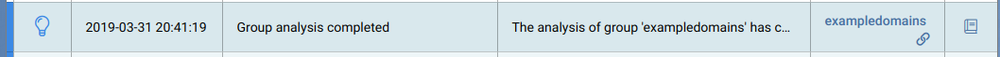
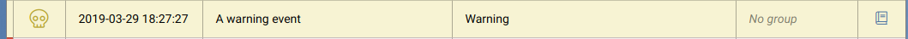
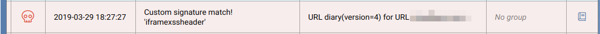
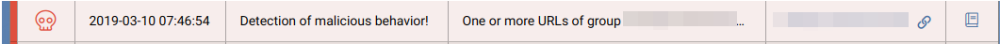
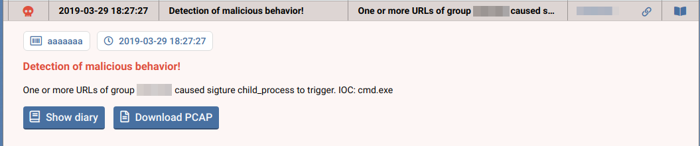
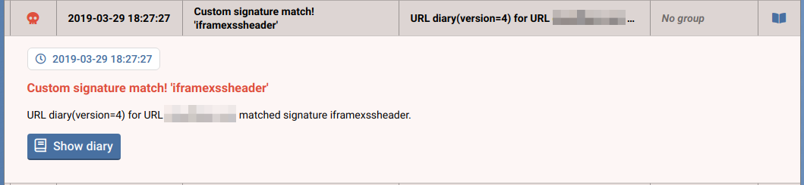
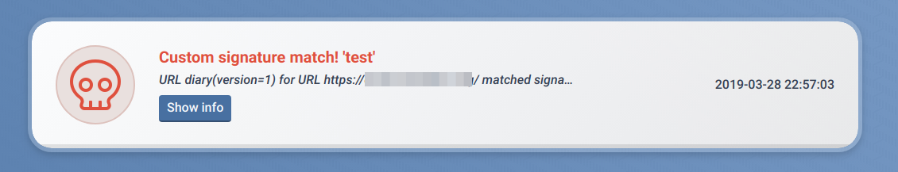
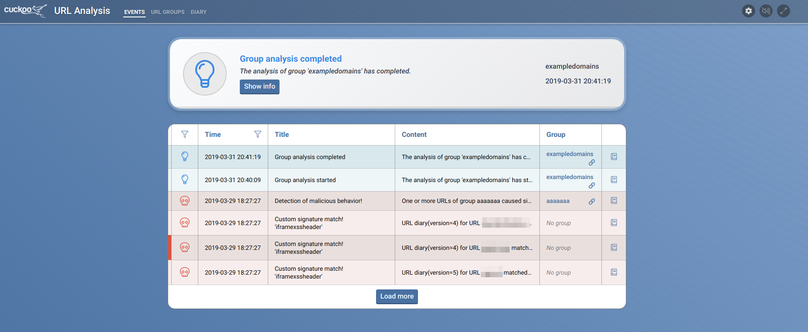

# Dashboard alerts

The alerts page is the main page of the operator dashboard. Any new incoming alerts are displayed here in real-time.

Alerts can be opened and collapsed. Opening an alert can reveal additional information, such as a link to a URL diary or a PCAP download in case of a detection.

When the kernel monitor detects a potentially malicious event, such as a new process, a high level alert will be displayed.

#### Alert types

There are multiple levels of alerts:

* Low *Blue* | level 1 - Informational messages, such as groups that start.

* Medium *Yellow* | level 2 - Warning or errors

* High *Red* | Detections of potentially malicious events.

#### Opening alerts

Opening an alert can reveal additional information, such as a link to a URL diary or a PCAP download in case of a detection.

#### Featured alert

The featured alert at the top of the page will always be the latest alert. If a high level alert occurs, this alert will not be replaced by an alert of a lower level, unless the webpage is refreshed.

