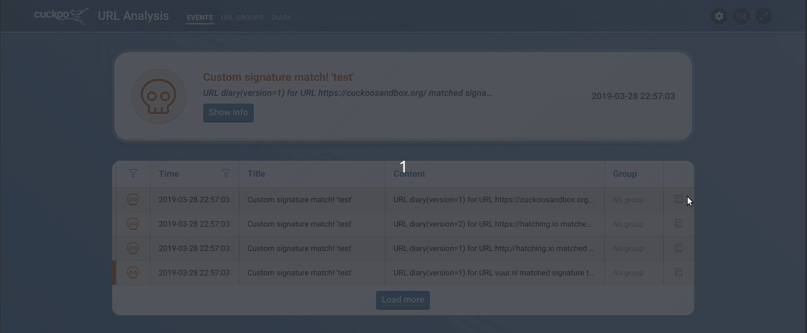

# Analysis profiles

Analysis profiles represent the VM and settings for an analysis. It can be used to configure multiple 'environments' for a group to be analyzed on.
An example of this would be to analyze a group on Windows 7 with IE11, Windows 7 with Firefox, and Windows 10 with Edge.

The analysis profiles contain multiple settings:

* Browser - Internet Explorer, Firefox or Edge
* Route - Internet, VPN or SOCKS5. Routing options can only be selected if they have been configured.
* Country - Used if VPN or SOCKS5 has this configured.
* Tags - These are Cuckoo machine/VM tags, and are used to determine what VM should be used. It will display the tags are in the machinery.conf.

<u>The tags are helper strings, the operator is responsible for ensuring the tags actually correspond to machines that have the property a tag describes.</u>

After creating a profile, it can be selected in [group management](/dashboard/urlgroups#group-managing). Profiles can be deleted and updated after creation. A profile can only be deleted if it is not configured for one of the URL groups.

