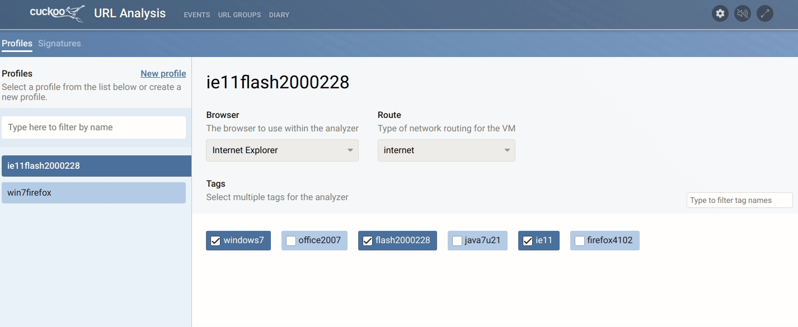

# URLdiary signatures

URL diary signatures are custom sets of rules/complex searches that can be stored. When enabled, each new URL diary will be searched for matches. If any matches are found, an alert of the configured level will be raised to notify the operator.

After creating, signatures can be run manually to test if they match they intended URL diaries. This can be done by clicking the 'Find all matches' button. This will not raise any alerts.

###### Signature logic

A URL diary signature can match four different types of data:

- Request URLs
- Request data
- Response data
- Executed javascript.

For each type of data, a signature can have one or more ‘must’ or ‘any’ rules.

**Must**

As the name suggests, data in the ‘must’ field, must be present in the field that is searched. If it is not, the signature will not match. Multiple must fields can be added per type of data.

**Any**

Data in the ‘any’ field is similar to ‘must’ as that one or more of its values must match. The ‘any’ field field is matched if the searched data contains one or more of the specified values.

