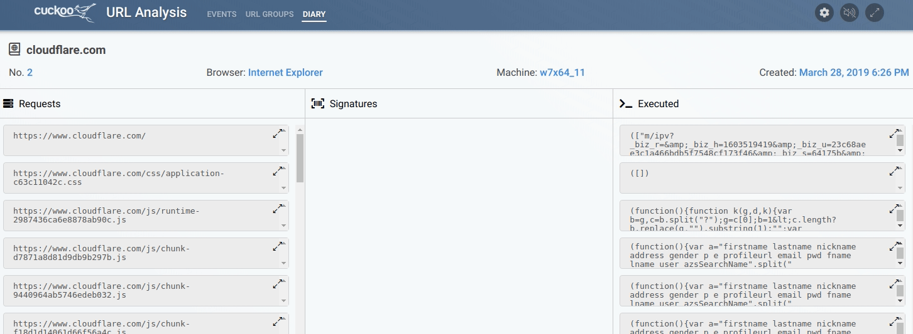
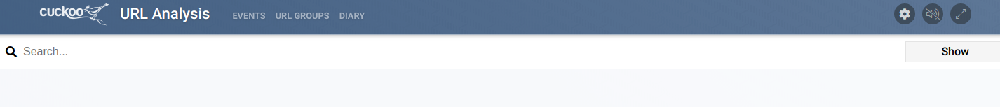

# URL diaries

A URL diary is a searchable collection the network requests made, and possibly interesting executed javascript. It only contains data generated by the specific URL the diary is for. Each time a group is analyzed, a new URL diary is created for each analyzed URL. The network requests, signatures, and javascript can be further examined by click an entry to open it.

The diary view page states when a diary was created, the version (a counter), what browser was used to open the URL, and the VM it was opened on.

#### Opening a URL diary

URL diaries can be opened from the 'view' page of a group, the diary search results, diary signature creator, and from alerts.

###### Network requests

Network requests are sorted by the URL they were performed to. A request log can be opened by clicking it. This will show the requests made and responses received for that specific URL.

###### Executed javascript

Potentially interesting executed javascript is stored. *This currently only works for IE8 and IE11*. Executed javascript can be clicked to open a screen that shows a beautified version of it.

###### Triggered real-time signatures

The diary contains a section for triggered signatures and the indicators of compromise for that trigger. This section does not contain custom URL diary signatures.
It contains signatures triggered by the real-time processing component, which acts upon collected kernel-level events by the kernel monitor.

#### Diary search

Searching the complete history of URL diaries. Multiple filters are available. If no filters are specified, all content will be searched.
The '*' wildcard can be used, but can cause inaccurate results if the string is short. Multiple filters can be combined by using 'AND' after each filter. filters must always be directly followed by a colon.

###### Available search filters

* `url` - This specific URL
* `requests` - Match string in requested URL/URI strings
* `javascript` - Match string in executed javascript
* `signatures` - Match string in matched real-time signature (Not custom URL diary signatures)

