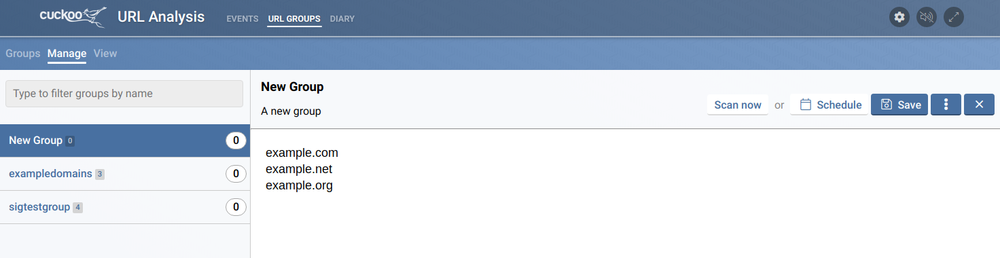
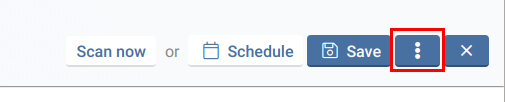
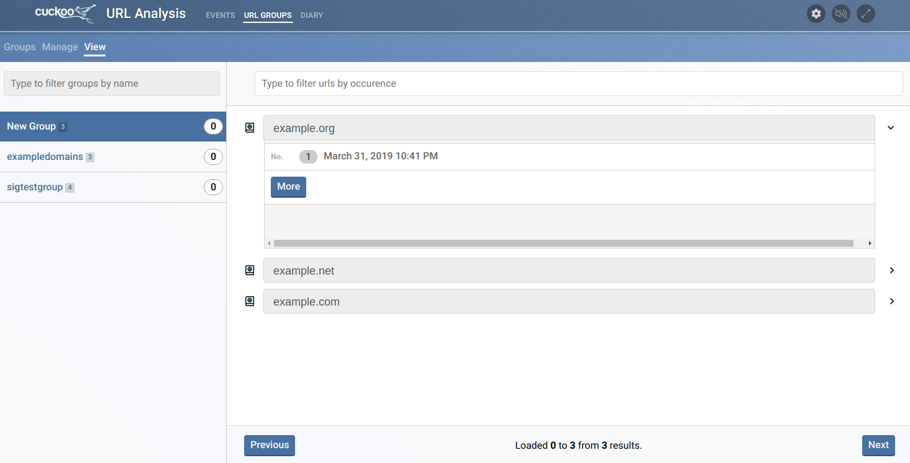

# URL groups

#### Group creation

A group holds a large amount of URLs. Before URLs can be analyzed, a group must fist be created.

#### Group managing

Besides adding URLs them, groups have multiple settings that influence how groups are analyzed. After clicking 'Manage' and selecting a group, multiple actions are possible.

###### Managing URLs

URLs can be added by typing or pasting them in the area that is visible after selecting a group in 'Manage'. Each URL should be on a new line.
This way of adding URLs is not recommended for adding large amounts of URLs 1000+. For more URLs, use the [URL adding API](/webapi#apigroupgroupurladd). This allows for bulk adding of URLs and specifying a separator.

After adding URLs, click 'Save'. URLs can be deleted in the same way.

###### Group settings

Before a group can be scheduled to be analyzed, it must have URLs and at least one analysis profile.

Let us assume we want to analyze this group on Windows 7 with IE11.
Group settings allows for multiple settings:

* Selecting analysis profiles - The environments a group should be analyzed on.
* Setting the URL threshold - The amount of URLs per created task when scheduling the group. Recommended is >= 10 <= 60.
* Setting the URL batch size - The amount of URLs opened at the same time inside of the VM. Recommended is >= 4 <= 8.
* Setting the batch timeout - The amount of seconds the URL batch remains opened before the next batch is opened. Recommended is >= 30 <= 60.

{: style="height:250px;width:450px"}

#### Result viewing

Results can be vieuwed per-url on the 'view' page. A collapsible list of URL diaries will be shown for each URL. Each URL diary shows the its version and date of creation. The diary can be clicked to be opened.

